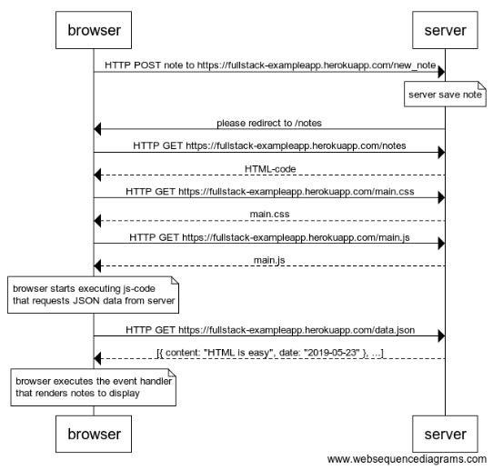

创建一个类似的图表，描述这种情况: 用户在页面上创建一个新的 Note，在文本区域写一些东西，然后点击提交按钮到 [https://fullstack-exampleapp.herokuapp.com/notes](https://fullstack-exampleapp.herokuapp.com/notes)。

如有必要，将浏览器或服务器上的操作显示为图表上的注释。

```
browser->server: HTTP POST note to https://fullstack-exampleapp.herokuapp.com/new_note
note over server:
server save note
end note

server->browser: please redirect to /notes

browser->server: HTTP GET https://fullstack-exampleapp.herokuapp.com/notes
server-->browser: HTML-code
browser->server: HTTP GET https://fullstack-exampleapp.herokuapp.com/main.css
server-->browser: main.css
browser->server: HTTP GET https://fullstack-exampleapp.herokuapp.com/main.js
server-->browser: main.js

note over browser:
browser starts executing js-code
that requests JSON data from server
end note

browser->server: HTTP GET https://fullstack-exampleapp.herokuapp.com/data.json
server-->browser: [{ content: "HTML is easy", date: "2019-05-23" }, ...]

note over browser:
browser executes the event handler
that renders notes to display
end note
```


